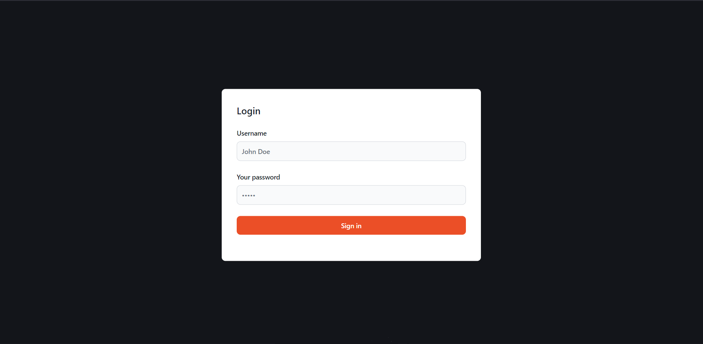
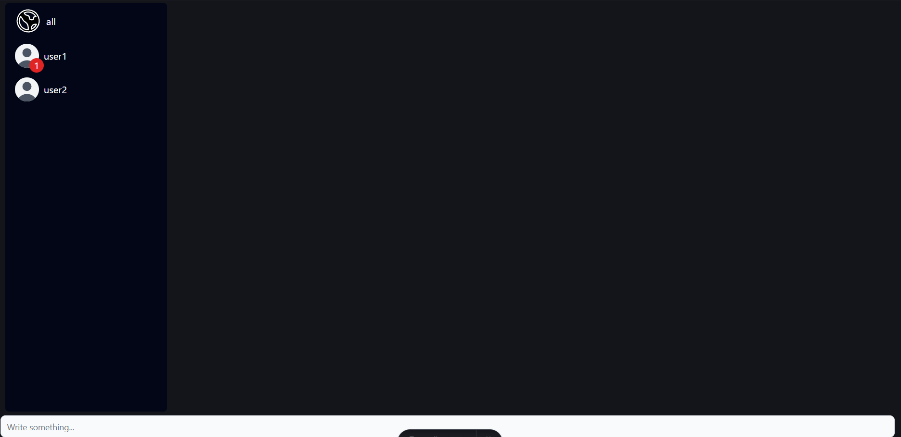
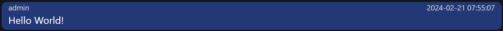

# MQTT Client

## Getting started:

* Clone the repository with ```git clone https://github.com/Noahgamerrr/mqtt-astro [YOUR-FOLDER-NAME]```
* Navigate to the newly created folder
* Run ```npm i```
* Run ```npm run dev``` (Build not intended but possible, as this is just a school project)

Now the MQTT-Chatclient should run on http://localhost:4321 and you should be seeing the following screen:



## Logging in

Right now, this MQTT-Client only contains three accounts, which are specified in the path
````/public/verySecurePasswords.json``` (School project security). This JSON-file contains
an Object with the usernames as the key and the password as the value. For example, the account "user1"
uses the password "password" in order to login. After an account has logged in, the following screen will appear:



### Note:

* The retain-flag for messages has not been set to true, because it felt useless if only the last message sent is being retained
* No session is created, so reloading will require you to log in again. This behaviour is intended however, as it is easier that way to use the client with multiple accounts on multiple different tabs simultaneously

## Features:

### MQTT-Broker:

This chat client uses the following MQTT-Broker: "ws://test.mosquitto.org:8081" and sends every
message on subtopic of: "at/htl-vil/arsicn/chat/"

### Messages:

You can write messages to different chatrooms. These messages are mostly built the same way (with exception of the delete messages):\
\
[Unique-UUID]\
[User]\
[Timestamp]\
[Message]\
\
Here's what a message looks like in the browser:

When you hover over your own message, a delete-button appears, which, when clicked, will ask you
if you are sure you want to delete that message. A delete-message is built different than a normal message:\
\
DELETE MESSAGE [Message UUID]

This message will be deleted for all users.

### Chatrooms

There are two types of chatrooms:

* Group chatrooms
* Private chatrooms

A group chatroom always ends with a subtopic that contains the group's name. A private chatroom, however, always ends with the name of the recipient. If, for example, user1 wants to sent a message to admin, then he will do so by using the topic: "at/htl-vil/arsicn/chat/admin". When admin receives that message, the client will attribute the message to the right user by looking at the message itself.\
\
If you receive a message from a user or in a group, and you are currently chating in another chatroom,
you will notified bu a red circle next to the chatroom icon with a number containing the amount of unread messages.\
\
Here is an example of an unread message\
\
If an unread message is deleted, the counter will decrease respectively
